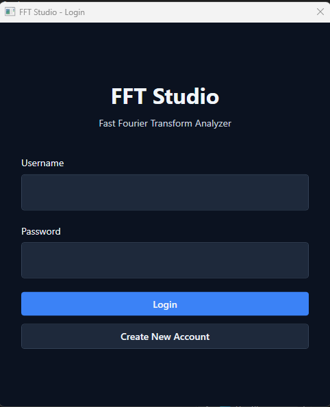
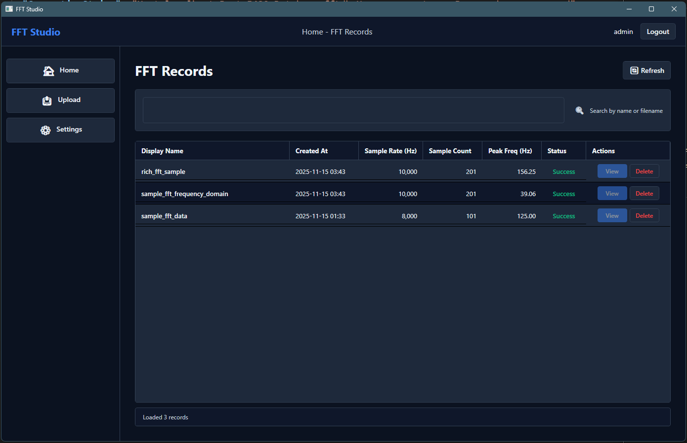
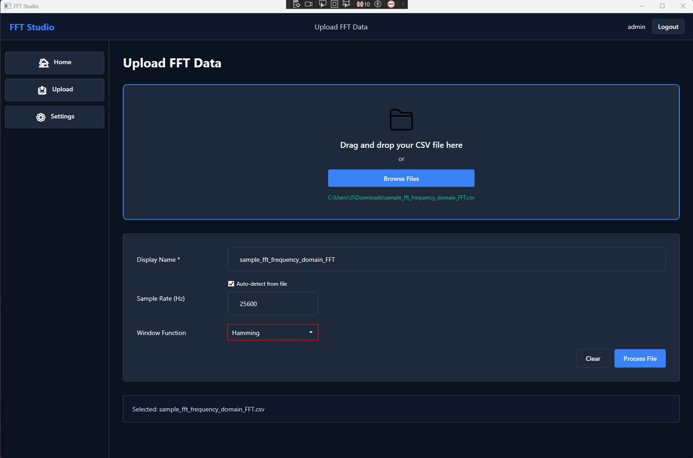
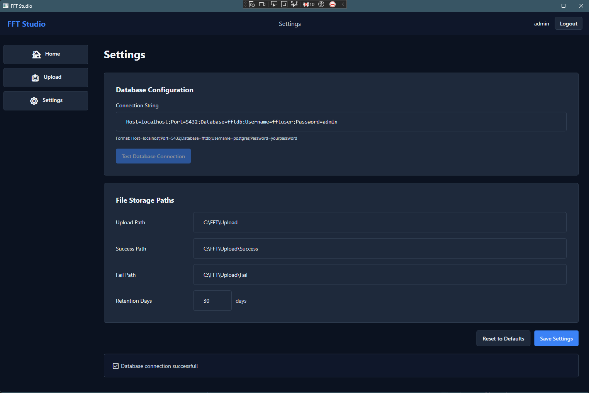
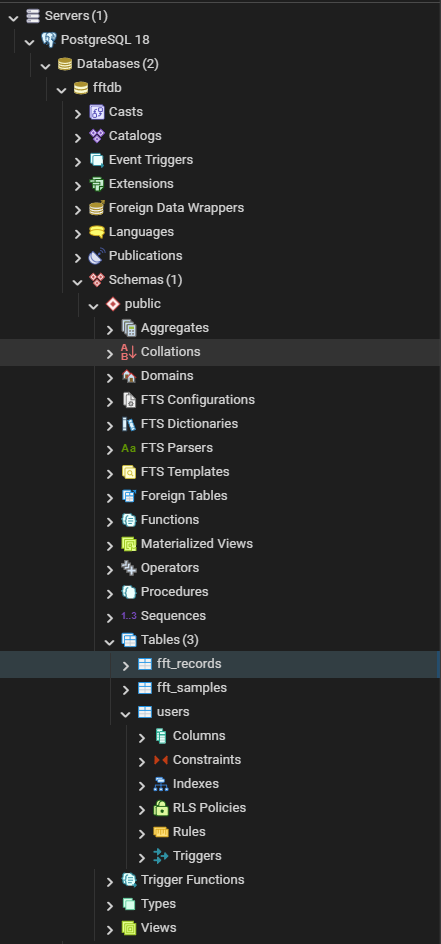

# FFT Data Analyzer

A Windows desktop application for Fast Fourier Transform (FFT) analysis of vibration and signal data.

## Features

- **Interactive Visualization**: Real-time FFT charts with zoom, pan, and auto-scaling
- **Export Capabilities**: Export to PNG (charts) and CSV (data)
- **Peak Detection**: Automatically identifies top 10 dominant frequencies
- **Window Functions**: Hann, Hamming, Blackman, or None
- **User Authentication**: Secure PBKDF2-hashed password system
- **Database Storage**: PostgreSQL backend with batch insert optimization
- **File Processing**: Automatic CSV parsing with time/frequency domain detection
- **Modern Dark UI**: Professional WPF interface with custom styling
- **Production Ready**: Minimal logging, proper error handling, optimized performance

## Technology Stack

- **Framework**: .NET Framework 4.8 WPF (MVVM)
- **Charting**: ScottPlot.WPF 4.1.74
- **FFT Engine**: MathNet.Numerics 5.0
- **Database**: PostgreSQL 15+ (Npgsql 6.0 + Dapper) (Using v18, it is working fine)
- **Logging**: NLog 5.3 (Currently in Info Level)

## Architecture

- **MVVM Pattern**: Clean separation of UI, logic, and data
- **Service Layer**: FftService, FileService, DbService, AuthService
- **Dependency Injection**: ServiceLocator pattern
- **Database**: Auto-creates schema on first run

## Screenshots

### 1. Create Account Page


### 2. Login Page



### 3. Main Application Pages



### 4. Upload Page



### 5. Settings Page




## Quick Start

### Prerequisites
- Windows 10/11
- Visual Studio 2019+
- .NET Framework 4.8
- PostgreSQL 15+



### Setup
1. **Database**: Create database `fftdb` (tables auto-create on first run)
2. **Build**: Open in Visual Studio, restore NuGet packages, build (Ctrl+Shift+B)
3. **Configure**: Update connection string in `C:\ProgramData\FFTStudio\appsettings.json`
4. **Run**: Press F5

### First Use
1. Create account → Login
2. Upload CSV file (time-domain or frequency-domain)
3. View FFT results and export data

## CSV File Format

**Time-domain** (app computes FFT):
```csv
Time,Amplitude
0.0000,0.0000
0.0001,0.5878
```

**Frequency-domain** (pre-computed):
```csv
FrequencyHz,Amplitude
0,0.12
10,0.45
```

Sample rate auto-detection supported.

## Configuration

**Location**: `C:\ProgramData\FFTStudio\appsettings.json`

```json
{
  "ConnectionString": "Host=localhost;Port=5432;Database=fftdb;Username=postgres;Password=yourpassword",
  "UploadPath": "C:\\FFT\\Upload",
  "SuccessPath": "C:\\FFT\\Upload\\Success",
  "FailPath": "C:\\FFT\\Upload\\Fail",
  "StagingPath": "C:\\FFT\\Upload\\Staging"
}
```

**Logs**: `C:\ProgramData\FFTStudio\Logs\`

## Performance

- FFT Processing: ~100ms for 10K samples
- Batch Insert: ~500ms for 10K samples
- Async operations for UI responsiveness
- Optimized for datasets up to 1M samples

## Security

- PBKDF2-SHA256 password hashing (10K iterations)
- Parameterized SQL queries (Dapper)
- Protected configuration directory
- Error-only logging in production
